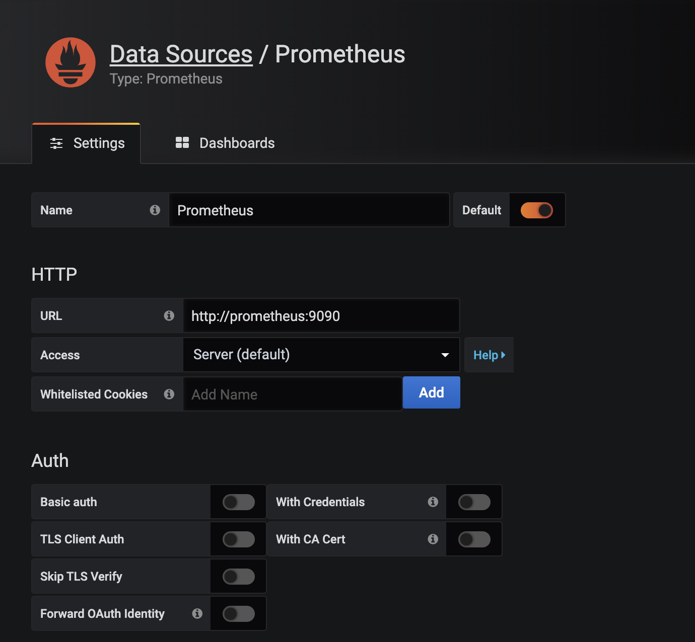
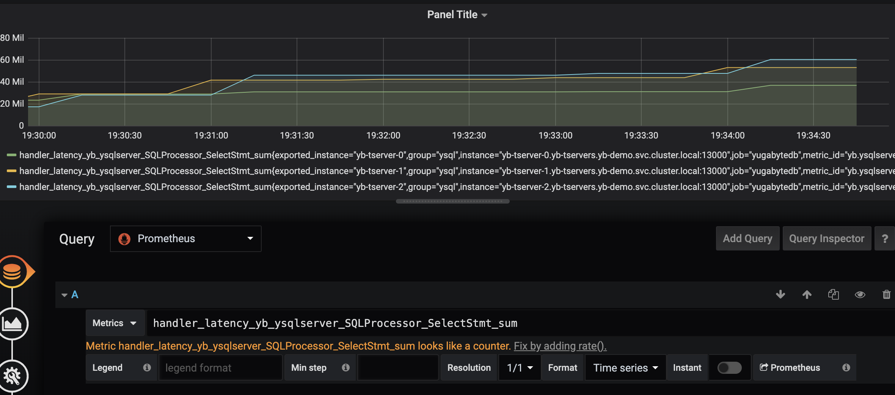

**Using Prometheus and Grafana with YugabyteDB**

This repository contains example YAMLs for standing up Prometheus and Grafana instances for performance monitoring of a YugabyteDB on a Kubernetes cluster. These source files can be customized for your specfic deployment.

**Compatibility**
|Product	|		Version		|
|-----------|-------------------|
|YugabyteDB |		1.x, 2.x 	|
|Kubernetes	|		1.12+		|
|Prometheus	|		2.x 		|
|Grafana	|		6.x 		|

**Architecture**

- Prometheus: Deployment is a single pod that uses a simple Prometheus configmap that to scrape the YugabyteDB master and tserver pods as well as kube-state-metrics. Service is configured as a headless internal facing service.
- Grafana: Deployment is a single pod that uses a single persistent volume for storage. Service is configured as a LoadBalancer for external consumption. Default password is 'admin' but can be configured in the deployment example yaml.

**Usage**

1. Install YugaByte DB
You should first install YugaByte DB, which is a distributed SQL database compatible with the PostgreSQL language. Getting started available from https://docs.yugabyte.com/latest/quick-start/. If using helm, you can use
```
helm install yb-demo --namespace yb-demo yugabytedb/yugabyte -f https://raw.githubusercontent.com/YugaByte/charts/master/stable/yugabyte/expose-all.yaml --wait --set resource.master.requests.cpu=0.1,resource.master.requests.memory=0.2Gi,resource.tserver.requests.cpu=0.1,resource.tserver.requests.memory=0.2Gi
```

2. Bring up the monitoring components using a clone of this repo. Make sure you customize the namespace to your specific deployment. The given examples will deploy to the 'yb-demo' namespace.
```
git clone https://github.com/yugabyte/yb-monitoring.git
kubectl create -f k8s-monitoring/
```

3. Verify the monitoring pods are running and access Grafana via a web browser.
```
kubectl get pods -n yb-demo
kubectl get svc -n yb-demo
```

4. Configure your Prometheus instance as a source of data for Grafana. If deployed as is, the Prometheus will be accessible at *http://prometheus:9090*



5. Build your Grafana dashboard

